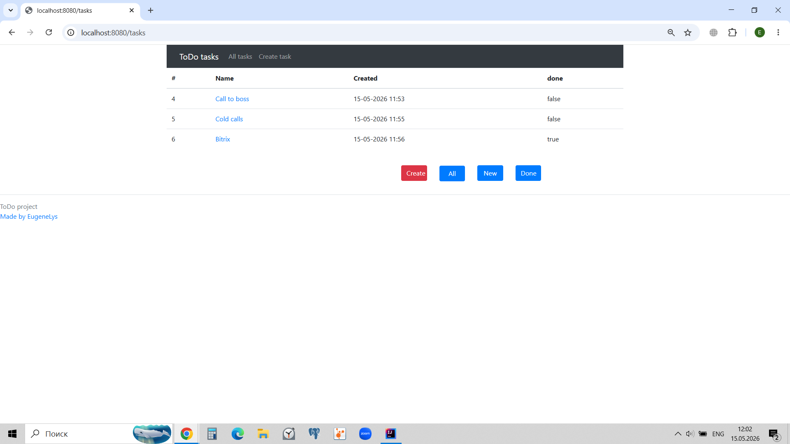
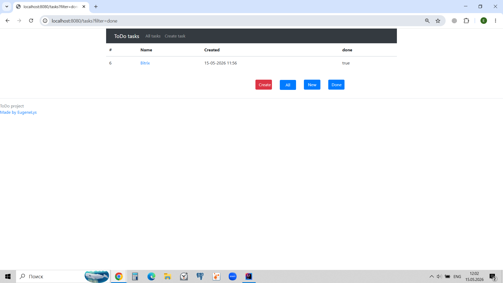
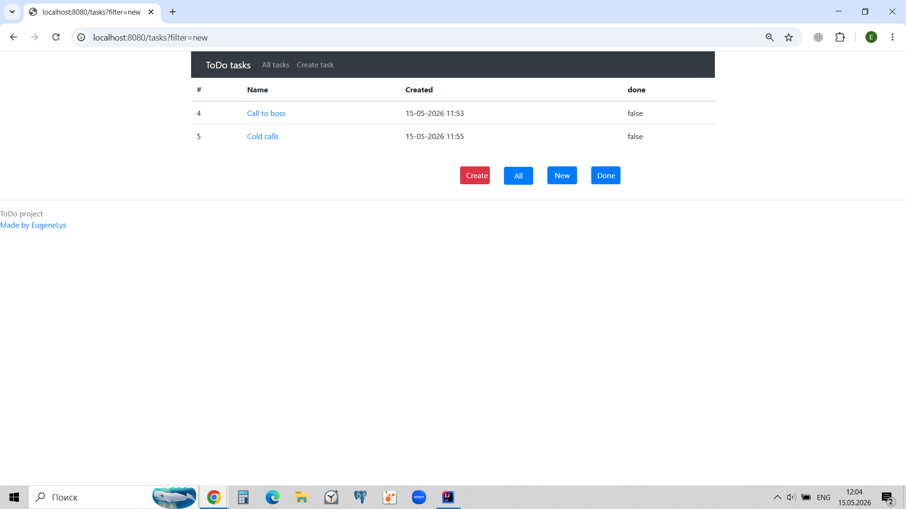
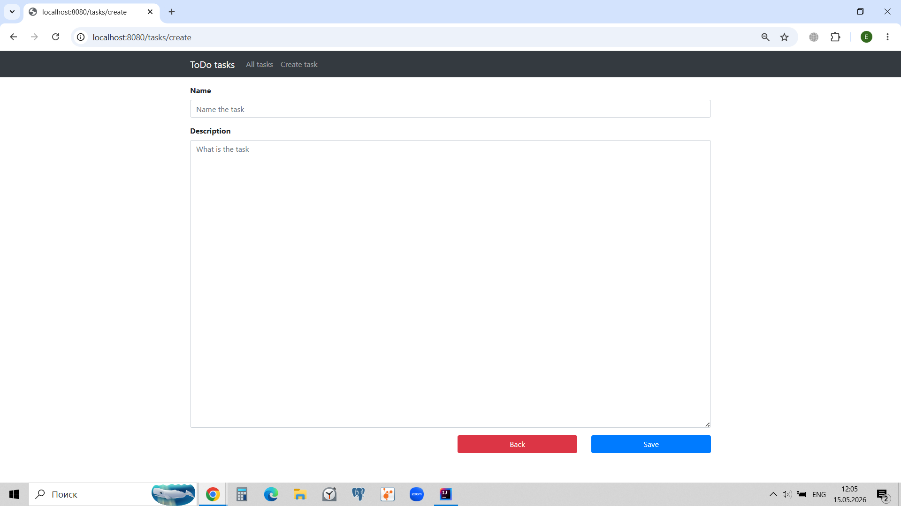
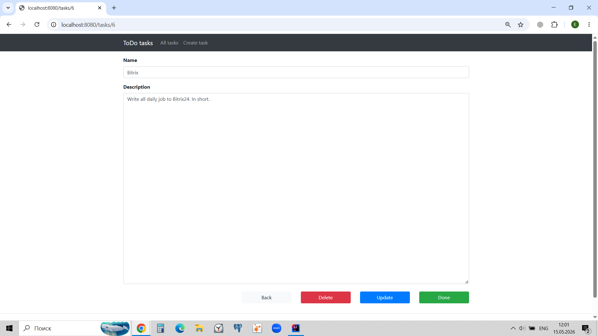

This is **job4j_todo** project.
It helps to plan your work or personal tasks and get different views of them. 
I.e. only done tasks, or only taks in work, or all together.
Tasks are saved in database.

Application is based on Java 17, SpringBoot, Hibernate 6, Lombok technologies.

You will need browser, Java 17 (or higher) and PostgreSQL to use it. 

To start working please create new database in PG Admin 
or using `create database todo;` command in terminal;

Look at usual views of working in this application:

View of all tasks list:

View of done tasks list:

View of new (in work) tasks list:

View of creation of new task: 

View of update of the task:

your feedback is welcome:
eugene.lysakov@gmail.com